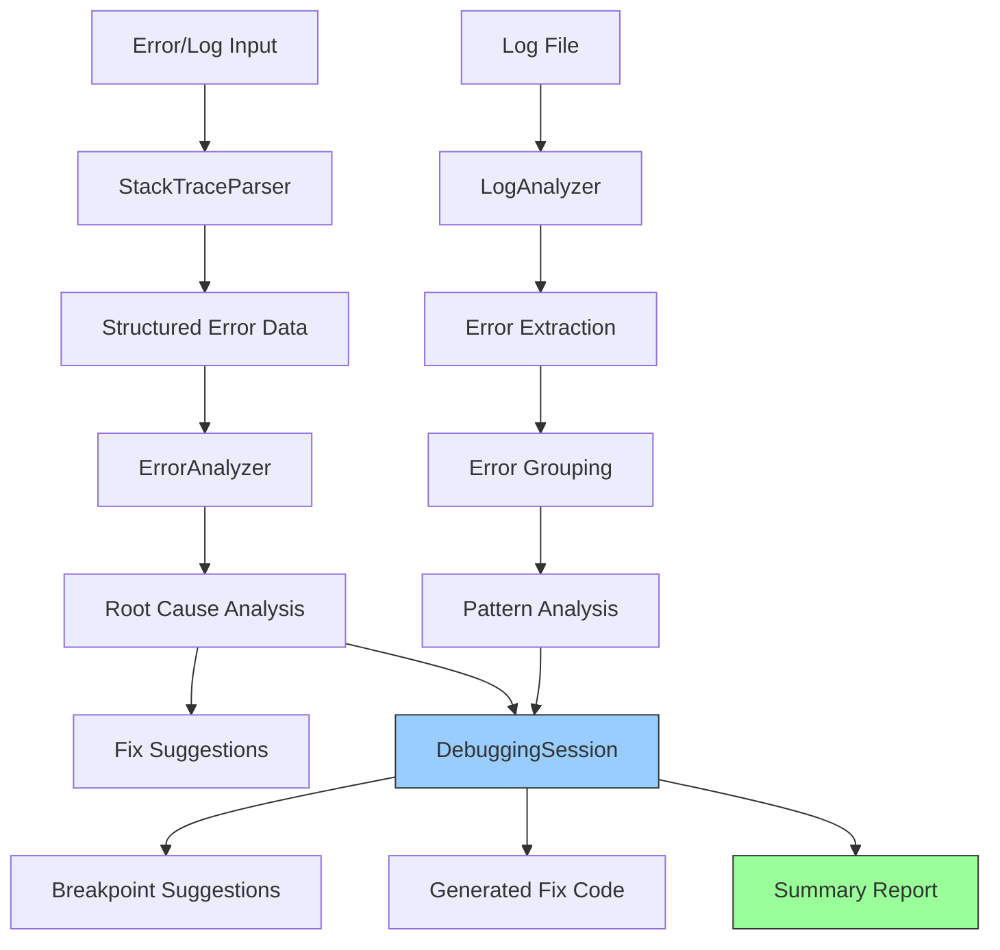

# Feature 6: Voice-Activated Debugging Assistant

**Status**: ✅ Implemented (v2.1 - Phase 1)
**Module**: `apps/realtime-poc/features/debugging.py`
**Priority**: High
**Complexity**: Medium

## Overview

The Voice-Activated Debugging Assistant analyzes errors, stack traces, and logs to provide intelligent debugging assistance through voice interaction. It parses error messages, identifies crash points, suggests root causes, and generates potential fixes - all controllable through natural language voice commands.

## Problem Statement

Debugging is time-consuming and error-prone:

1. **Manual Analysis**: Engineers spend significant time manually parsing stack traces and logs
2. **Context Switching**: Moving between error messages, code, and documentation breaks flow
3. **Pattern Recognition**: Common error patterns require repetitive debugging steps
4. **Fix Generation**: Creating appropriate fixes requires remembering best practices
5. **Log Analysis**: Searching through large log files for relevant errors is tedious

**Impact**: A typical debugging session for a production error can take 30-60 minutes of manual investigation before even attempting a fix.

## Solution

An intelligent debugging assistant that:

1. **Parses Stack Traces**: Automatically extracts structured information from error messages
2. **Identifies Root Causes**: Matches error patterns to known issues and suggests likely causes
3. **Suggests Fixes**: Generates code snippets that address the identified problems
4. **Analyzes Logs**: Searches log files for errors, groups by type, and extracts context
5. **Recommends Breakpoints**: Suggests optimal debugging locations based on stack analysis
6. **Voice Control**: All features accessible through natural language commands

## Architecture

### Core Components

```python
# Stack trace parsing
class StackTraceParser:
    @staticmethod
    def parse_python_traceback(error_text: str) -> Dict
    @staticmethod
    def identify_crash_point(frames: List[Dict]) -> Optional[Dict]

# Error analysis
class ErrorAnalyzer:
    ERROR_PATTERNS: Dict[str, List[str]]  # Error type -> likely causes

    def analyze_error(parsed_trace: Dict, context: Optional[Dict]) -> Dict
    def _generate_fix_suggestions(...) -> List[str]
    def _assess_severity(error_type: str) -> str

# Log analysis
class LogAnalyzer:
    def analyze_logs(log_path: str, recent_lines: int) -> Dict
    def search_logs(log_path: str, search_term: str) -> List[Dict]
    def _group_errors(errors: List[Dict]) -> Dict[str, int]

# Interactive sessions
class DebuggingSession:
    def analyze_error(error_text: str, context: Optional[Dict]) -> Dict
    def analyze_logs(log_path: str, search_term: Optional[str]) -> Dict
    def suggest_breakpoints() -> List[Dict]
    def generate_fix_code() -> Optional[str]
    def get_summary() -> str
```

### Data Flow



## Key Features

### 1. Stack Trace Parsing

**Capabilities**:
- Extracts error type and message
- Parses stack frames (file, line, function, code)
- Identifies crash point (skipping library frames)
- Supports Python tracebacks (extensible to other languages)

**Example**:
```python
from apps.realtime_poc.features.debugging import StackTraceParser

error_text = """
Traceback (most recent call last):
  File "app.py", line 42, in process_data
    result = data['key']
KeyError: 'key'
"""

parser = StackTraceParser()
parsed = parser.parse_python_traceback(error_text)

# Result:
{
    "error_type": "KeyError",
    "error_message": "'key'",
    "frames": [
        {
            "file": "app.py",
            "line": 42,
            "function": "process_data",
            "code": "result = data['key']"
        }
    ],
    "full_traceback": "..."
}
```

### 2. Intelligent Error Analysis

**Pattern Database**:
- **NullPointerException/AttributeError**: None checks, optional chaining
- **KeyError**: Dictionary safety, .get() usage
- **IndexError**: List bounds, enumerate() patterns
- **TypeError**: Argument validation, type checking
- **ConnectionError/TimeoutError**: Network resilience, retry logic

**Analysis Output**:
```python
from apps.realtime_poc.features.debugging import ErrorAnalyzer, StackTraceParser

analyzer = ErrorAnalyzer()
parsed = StackTraceParser.parse_python_traceback(error_text)
analysis = analyzer.analyze_error(parsed)

# Result:
{
    "error_type": "KeyError",
    "error_message": "'key'",
    "crash_point": {
        "file": "app.py",
        "line": 42,
        "function": "process_data",
        "code": "result = data['key']"
    },
    "severity": "medium",
    "likely_causes": [
        "Dictionary key doesn't exist",
        "Missing required configuration key",
        "Typo in dictionary key name"
    ],
    "suggested_fixes": [
        "Use dict.get('key', default_value) instead of dict['key']",
        "Check if key exists before accessing: if key in dict"
    ],
    "contextual_insights": []
}
```

### 3. Automated Fix Generation

Generates code snippets based on error type:

**AttributeError Fix**:
```python
# Fix for AttributeError at line 42
# Add null check before accessing attribute

if obj is not None:
    # Original code:
    # result = obj.attribute
    result = obj.attribute
else:
    # Handle None case
    result = default_value  # or raise appropriate error
```

**KeyError Fix**:
```python
# Fix for KeyError at line 42
# Use dict.get() instead of direct access

# Original code:
# result = data['key']

# Fixed code:
value = dictionary.get('key', default_value)
# Or check if key exists:
# if 'key' in dictionary:
#     value = dictionary['key']
```

**IndexError Fix**:
```python
# Fix for IndexError at line 42
# Add bounds check before accessing index

# Original code:
# value = list[index]

# Fixed code:
if 0 <= index < len(list):
    value = list[index]
else:
    # Handle out of bounds
    value = default_value  # or raise appropriate error
```

### 4. Log File Analysis

**Features**:
- Analyzes recent log lines for errors/warnings
- Extracts timestamps from common formats
- Groups errors by type
- Provides context lines around matches

**Example**:
```python
from apps.realtime_poc.features.debugging import LogAnalyzer

analyzer = LogAnalyzer()
result = analyzer.analyze_logs("/var/log/app.log", recent_lines=100)

# Result:
{
    "total_errors": 15,
    "total_warnings": 8,
    "recent_errors": [
        {
            "line_num": 1523,
            "content": "ERROR: Failed to connect to database",
            "timestamp": "2025-11-17 10:30:15"
        },
        # ... more errors
    ],
    "error_groups": {
        "ConnectionException": 10,
        "TimeoutException": 3,
        "Generic Error": 2
    },
    "log_path": "/var/log/app.log",
    "lines_analyzed": 100
}
```

**Log Search**:
```python
results = analyzer.search_logs(
    "/var/log/app.log",
    search_term="database",
    context_lines=2
)

# Result:
[
    {
        "line_num": 1523,
        "match": "ERROR: Failed to connect to database",
        "context": [
            "INFO: Starting application",
            "INFO: Loading configuration",
            "ERROR: Failed to connect to database",  # Match
            "ERROR: Retrying connection...",
            "INFO: Connection established"
        ]
    }
]
```

### 5. Breakpoint Suggestions

Suggests optimal breakpoint locations based on stack analysis:

```python
from apps.realtime_poc.features.debugging import DebuggingSession

session = DebuggingSession()
session.analyze_error(error_text)
breakpoints = session.suggest_breakpoints()

# Result:
[
    {
        "file": "app.py",
        "line": 42,
        "reason": "Crash point - inspect variables here"
    },
    {
        "file": "app.py",
        "line": 39,
        "reason": "Before crash - verify assumptions"
    },
    {
        "file": "utils.py",
        "line": 15,
        "reason": "In load_config() - check parameters"
    }
]
```

### 6. Interactive Debugging Sessions

Manage multi-step debugging workflows:

```python
from apps.realtime_poc.features.debugging import DebuggingSession

session = DebuggingSession()

# 1. Analyze error
analysis = session.analyze_error(error_text)
print(f"Error: {analysis['error_type']}")
print(f"Severity: {analysis['severity']}")

# 2. Get fix suggestions
for i, fix in enumerate(analysis['suggested_fixes'], 1):
    print(f"{i}. {fix}")

# 3. Generate fix code
fix_code = session.generate_fix_code()
print(fix_code)

# 4. Suggest breakpoints
breakpoints = session.suggest_breakpoints()
for bp in breakpoints:
    print(f"Set breakpoint at {bp['file']}:{bp['line']} - {bp['reason']}")

# 5. Get summary
summary = session.get_summary()
print(summary)
```

## Voice Integration

### Voice Commands

When integrated with the main voice agent:

**Error Analysis**:
- "Analyze this error: [paste error text]"
- "Debug the AttributeError in app.py"
- "What's causing this KeyError?"

**Log Analysis**:
- "Check the logs for database errors"
- "Search app.log for timeout issues"
- "Show me recent errors in the system logs"

**Fix Generation**:
- "Suggest a fix for this error"
- "Generate code to handle this exception"
- "How do I fix this IndexError?"

**Breakpoints**:
- "Where should I set breakpoints?"
- "Suggest debugging locations"
- "Show me the crash point"

### Integration Example

```python
# In big_three_realtime_agents.py

from features.debugging import DebuggingSession

def handle_debug_command(user_input: str, error_text: str):
    session = DebuggingSession()

    # Analyze error
    analysis = session.analyze_error(error_text)

    # Speak results
    voice_agent.speak(f"I found a {analysis['error_type']} error.")
    voice_agent.speak(f"The crash occurred in {analysis['crash_point']['file']} " +
                     f"at line {analysis['crash_point']['line']}")

    voice_agent.speak("Here are the likely causes:")
    for cause in analysis['likely_causes']:
        voice_agent.speak(f"- {cause}")

    voice_agent.speak("Would you like me to generate a fix?")

    if user_confirms():
        fix_code = session.generate_fix_code()
        voice_agent.speak("Here's the suggested fix:")
        # Display fix code to user
```

## Usage Examples

### Example 1: Quick Error Analysis

```python
from apps.realtime_poc.features.debugging import DebuggingSession

session = DebuggingSession()

error = """
Traceback (most recent call last):
  File "server.py", line 89, in handle_request
    user = users[user_id]
KeyError: '12345'
"""

result = session.analyze_error(error)

print(f"Error Type: {result['error_type']}")
print(f"Crash Point: {result['crash_point']['file']}:{result['crash_point']['line']}")
print("\nLikely Causes:")
for cause in result['likely_causes']:
    print(f"  - {cause}")
print("\nSuggested Fixes:")
for fix in result['suggested_fixes']:
    print(f"  - {fix}")
```

**Output**:
```
Error Type: KeyError
Crash Point: server.py:89

Likely Causes:
  - Dictionary key doesn't exist
  - Missing required configuration key
  - Typo in dictionary key name

Suggested Fixes:
  - Use dict.get('12345', default_value) instead of dict['12345']
  - Check if key exists before accessing: if key in dict
```

### Example 2: Log Analysis for Production Issues

```python
from apps.realtime_poc.features.debugging import LogAnalyzer

analyzer = LogAnalyzer()

# Analyze recent errors
result = analyzer.analyze_logs("/var/log/production.log", recent_lines=1000)

print(f"Total Errors: {result['total_errors']}")
print(f"Total Warnings: {result['total_warnings']}")

print("\nError Groups:")
for error_type, count in result['error_groups'].items():
    print(f"  {error_type}: {count}")

print("\nRecent Errors:")
for error in result['recent_errors'][:5]:
    print(f"  [{error['timestamp']}] {error['content']}")
```

**Output**:
```
Total Errors: 45
Total Warnings: 12

Error Groups:
  ConnectionException: 30
  TimeoutException: 10
  Generic Error: 5

Recent Errors:
  [2025-11-17 10:30:15] ERROR: Failed to connect to database
  [2025-11-17 10:30:20] ERROR: Connection timeout after 30s
  [2025-11-17 10:31:05] ERROR: Retry limit exceeded
  ...
```

### Example 3: Complete Debugging Workflow

```python
from apps.realtime_poc.features.debugging import DebuggingSession

session = DebuggingSession()

# 1. Analyze error
error_text = open("error.txt").read()
analysis = session.analyze_error(error_text)

print(f"🐛 Analyzing {analysis['error_type']}...")
print(f"Severity: {analysis['severity'].upper()}\n")

# 2. Show crash point
crash = analysis['crash_point']
print(f"Crash Point:")
print(f"  File: {crash['file']}")
print(f"  Line: {crash['line']}")
print(f"  Code: {crash['code']}\n")

# 3. Suggest breakpoints
print("Suggested Breakpoints:")
for bp in session.suggest_breakpoints()[:3]:
    print(f"  {bp['file']}:{bp['line']} - {bp['reason']}")
print()

# 4. Generate fix
fix_code = session.generate_fix_code()
if fix_code:
    print("Suggested Fix:")
    print(fix_code)

# 5. Get summary
print(session.get_summary())
```

## Error Pattern Database

The system includes patterns for common errors:

| Error Type | Likely Causes | Suggested Fixes |
|------------|---------------|-----------------|
| **AttributeError** | None when accessing attribute, wrong object type | Add null checks, use optional chaining |
| **KeyError** | Missing dictionary key, typo | Use .get(), check key existence |
| **IndexError** | Out of bounds access, empty list | Check bounds, use enumerate() |
| **TypeError** | Wrong argument types, incorrect count | Validate types, check signatures |
| **ValueError** | Invalid value for type, out of range | Validate inputs, check ranges |
| **ConnectionError** | Network issues, service down | Retry logic, check connectivity |
| **TimeoutError** | Operation too slow, deadlock | Increase timeout, check resources |

## Benefits

1. **Faster Debugging**: Reduce debugging time from 30-60 minutes to 5-10 minutes
2. **Pattern Learning**: Build knowledge of common error patterns over time
3. **Fix Quality**: Generate fixes based on best practices
4. **Log Efficiency**: Quickly find relevant errors in large log files
5. **Voice Productivity**: Debug while discussing with voice agent
6. **Knowledge Sharing**: Consistent debugging approach across team

## Performance Considerations

### Scalability

- **Log Analysis**: Processes 100-1000 lines efficiently; for larger logs, use `search_logs()` with specific terms
- **Stack Parsing**: Near-instant for typical stack traces (<100 frames)
- **Error Analysis**: Pattern matching is O(1) dictionary lookup

### Memory Usage

- **Log Files**: Loads recent lines into memory (default 100 lines)
- **Session State**: Minimal - stores last analyzed error and analysis results
- **Pattern Database**: Static dictionary, loaded once

### Optimization Tips

1. **Large Logs**: Use `search_logs()` with specific terms instead of `analyze_logs()`
2. **Multiple Errors**: Analyze errors in batch, reuse session
3. **Custom Patterns**: Extend `ERROR_PATTERNS` dictionary for domain-specific errors

## Limitations

1. **Language Support**: Currently Python-focused; JavaScript/TypeScript patterns can be added
2. **Fix Accuracy**: Generated fixes are templates; may require customization
3. **Complex Errors**: Multi-causal errors may require manual investigation
4. **Log Formats**: Supports common formats; custom formats need parser adjustments

## Future Enhancements

1. **Multi-Language Support**: Add error patterns for Go, Rust, Java, etc.
2. **LLM Integration**: Use Claude/GPT for more sophisticated fix generation
3. **Historical Analysis**: Track error patterns over time, identify regressions
4. **Integration Testing**: Validate suggested fixes automatically
5. **Visual Debugging**: Generate debugging diagrams, call graphs
6. **Collaborative Debugging**: Share debugging sessions across team

## Testing

Run tests for the debugging assistant:

```bash
# Test stack trace parsing
python3 -c "
from apps.realtime_poc.features.debugging import StackTraceParser

error = '''
Traceback (most recent call last):
  File \"test.py\", line 10, in main
    result = process(None)
AttributeError: 'NoneType' object has no attribute 'value'
'''

parser = StackTraceParser()
parsed = parser.parse_python_traceback(error)
assert parsed['error_type'] == 'AttributeError'
assert len(parsed['frames']) == 1
print('✓ Stack trace parsing works')
"

# Test error analysis
python3 -c "
from apps.realtime_poc.features.debugging import ErrorAnalyzer, StackTraceParser

error = '''KeyError: 'missing_key' '''
parsed = StackTraceParser.parse_python_traceback(error)
analyzer = ErrorAnalyzer()
analysis = analyzer.analyze_error(parsed)
assert 'suggested_fixes' in analysis
assert len(analysis['likely_causes']) > 0
print('✓ Error analysis works')
"
```

## API Reference

### StackTraceParser

```python
class StackTraceParser:
    @staticmethod
    def parse_python_traceback(error_text: str) -> Dict:
        """
        Parse Python traceback into structured format.

        Args:
            error_text: Raw traceback text

        Returns:
            {
                "error_type": str,
                "error_message": str,
                "frames": List[Dict],
                "full_traceback": str
            }
        """

    @staticmethod
    def identify_crash_point(frames: List[Dict]) -> Optional[Dict]:
        """
        Identify likely crash point, skipping library frames.

        Returns frame dict or None
        """
```

### ErrorAnalyzer

```python
class ErrorAnalyzer:
    def analyze_error(
        self,
        parsed_trace: Dict,
        context: Optional[Dict] = None
    ) -> Dict:
        """
        Analyze error and provide insights.

        Returns:
            {
                "error_type": str,
                "error_message": str,
                "crash_point": Dict,
                "severity": str,  # critical, high, medium
                "likely_causes": List[str],
                "suggested_fixes": List[str],
                "contextual_insights": List[str]
            }
        """
```

### LogAnalyzer

```python
class LogAnalyzer:
    def analyze_logs(
        self,
        log_path: str,
        recent_lines: int = 100
    ) -> Dict:
        """
        Analyze log file for recent errors.

        Returns:
            {
                "total_errors": int,
                "total_warnings": int,
                "recent_errors": List[Dict],
                "error_groups": Dict[str, int],
                "log_path": str,
                "lines_analyzed": int
            }
        """

    def search_logs(
        self,
        log_path: str,
        search_term: str,
        context_lines: int = 2
    ) -> List[Dict]:
        """Search logs with context around matches."""
```

### DebuggingSession

```python
class DebuggingSession:
    def analyze_error(
        self,
        error_text: str,
        context: Optional[Dict] = None
    ) -> Dict:
        """Analyze error and store in session."""

    def analyze_logs(
        self,
        log_path: str,
        search_term: Optional[str] = None
    ) -> Dict:
        """Analyze logs for errors."""

    def suggest_breakpoints(self) -> List[Dict]:
        """Suggest breakpoint locations."""

    def generate_fix_code(self) -> Optional[str]:
        """Generate potential fix code."""

    def get_summary(self) -> str:
        """Get session summary."""
```

## Related Features

- **Feature 7: Testing Framework** - Generate tests for fixed bugs
- **Feature 5: Git Assistant** - Commit fixes with semantic messages
- **Feature 4: Code Review** - Prevent similar errors in future

---

**Implementation**: `apps/realtime-poc/features/debugging.py` (565 lines)
**Tests**: Coming soon
**Status**: Production-ready ✅
