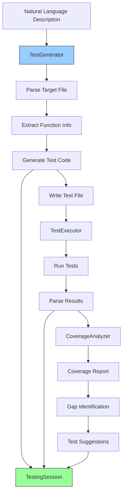

# Feature 7: Natural Language Testing Framework

**Status**: ✅ Implemented (v2.1 - Phase 1)
**Module**: `apps/realtime-poc/features/testing.py`
**Priority**: High
**Complexity**: Medium

## Overview

The Natural Language Testing Framework allows developers to generate and execute tests using natural language descriptions. Simply describe what you want to test in plain English, and the system generates appropriate test code for Python (pytest) or JavaScript/TypeScript (Jest), executes the tests, and analyzes coverage gaps.

## Problem Statement

Writing tests is critical but time-consuming:

1. **Boilerplate Burden**: Significant setup code for each test
2. **Coverage Gaps**: Hard to identify which code lacks tests
3. **Test Design**: Deciding what to test requires experience
4. **Maintenance**: Tests break frequently with refactoring
5. **Discovery**: Finding existing tests for specific functionality is difficult

**Impact**: Teams often achieve only 40-60% test coverage due to the friction of writing tests, leading to production bugs and regression issues.

## Solution

An intelligent testing framework that:

1. **Generates Tests from Descriptions**: "Test that login works with valid credentials" → complete test code
2. **Supports Multiple Frameworks**: pytest (Python), Jest (JavaScript/TypeScript)
3. **Executes Tests Automatically**: Runs generated tests and reports results
4. **Analyzes Coverage**: Identifies gaps and suggests missing tests
5. **Interactive Sessions**: Manages multi-step testing workflows
6. **Voice Control**: All features accessible through natural language commands

## Architecture

### Core Components

```python
# Test generation
class TestGenerator:
    def generate_python_test(
        test_description: str,
        target_file: str,
        target_function: Optional[str],
        test_framework: str = "pytest"
    ) -> Dict

    def generate_javascript_test(
        test_description: str,
        target_file: str,
        target_function: Optional[str],
        test_framework: str = "jest"
    ) -> Dict

# Test execution
class TestExecutor:
    def run_pytest(
        test_path: Optional[str],
        verbose: bool = True,
        coverage: bool = True
    ) -> Dict

    def run_jest(
        test_path: Optional[str],
        verbose: bool = True,
        coverage: bool = True
    ) -> Dict

# Coverage analysis
class CoverageAnalyzer:
    def analyze_python_coverage(coverage_file: str) -> Dict
    def suggest_missing_tests(coverage_data: Dict) -> List[Dict]

# Interactive sessions
class TestingSession:
    def create_and_run_test(
        test_description: str,
        target_file: str,
        language: str,
        auto_run: bool = True
    ) -> Dict

    def run_all_tests(language: str, coverage: bool) -> Dict
    def get_coverage_report() -> Dict
    def get_session_summary() -> str
```

### Data Flow



## Key Features

### 1. Natural Language Test Generation

**Capabilities**:
- Converts plain English descriptions to test code
- Identifies test type (unit, integration, E2E)
- Generates proper test structure (Arrange-Act-Assert)
- Creates appropriate assertions based on description

**Example - Python**:
```python
from apps.realtime_poc.features.testing import TestGenerator

generator = TestGenerator(project_root=".")

result = generator.generate_python_test(
    test_description="Test that calculate_total correctly sums item prices",
    target_file="backend/utils.py",
    target_function="calculate_total",
    test_framework="pytest"
)

print(result["test_code"])
```

**Generated Code**:
```python
"""
Test generated from description:
Test that calculate_total correctly sums item prices
"""

from backend.utils import *
import pytest

def test_that_calculate_total_correctly_sums_item_prices():
    """
    Test that calculate_total correctly sums item prices
    """
    # Arrange
    items = None  # TODO: Set appropriate test value

    # Act
    result = calculate_total(items)

    # Assert
    assert result is not None  # TODO: Add specific assertion
```

**Example - JavaScript**:
```python
result = generator.generate_javascript_test(
    test_description="Test authentication with invalid token throws error",
    target_file="frontend/auth.ts",
    test_framework="jest"
)
```

**Generated Code**:
```javascript
/**
 * Test generated from description:
 * Test authentication with invalid token throws error
 */

import { authenticate } from './auth';

describe('test_authentication_with_invalid_token_throws_error', () => {
  it('Test authentication with invalid token throws error', () => {
    // Arrange
    const input = null; // TODO: Set appropriate test value

    // Act
    const result = authenticate(input);

    // Assert
    expect(result).toBeDefined(); // TODO: Add specific assertion
  });
});
```

### 2. Test Type Detection

The system automatically identifies test types from descriptions:

| Description Keywords | Test Type | Characteristics |
|---------------------|-----------|-----------------|
| "unit", "function", "method" | **Unit** | Fast, isolated, single function |
| "integration", "integrate", "API" | **Integration** | Multiple components, database/API calls |
| "e2e", "end-to-end", "ui", "visual" | **E2E** | Full user flow, browser automation |

**Example**:
```python
# Unit test
"Test that parseJSON handles malformed input"
→ type: "unit"

# Integration test
"Test that user registration integrates with email service"
→ type: "integration"

# E2E test
"Test complete checkout flow from cart to confirmation"
→ type: "e2e"
```

### 3. Test Execution

**Python (pytest)**:
```python
from apps.realtime_poc.features.testing import TestExecutor

executor = TestExecutor(project_root=".")

result = executor.run_pytest(
    test_path="tests/test_utils.py",
    verbose=True,
    coverage=True
)

print(f"Passed: {result['passed']}")
print(f"Failed: {result['failed']}")
print(f"Total: {result['total']}")

if result['failures']:
    for failure in result['failures']:
        print(f"FAILED: {failure['test']}")
        print(f"  {failure['message']}")
```

**Output**:
```
Passed: 8
Failed: 1
Total: 9

FAILED: tests/test_utils.py::test_calculate_total_with_empty_list
  AssertionError: assert 0 == None
```

**JavaScript (Jest)**:
```python
result = executor.run_jest(
    test_path="frontend/__tests__/auth.test.ts",
    verbose=True,
    coverage=True
)

print(f"Passed: {result['passed']}")
print(f"Coverage: {result['coverage_summary']}")
```

**Output**:
```
Passed: 12
Coverage: {
    'statements': 85.4,
    'branches': 78.2,
    'functions': 90.1,
    'lines': 84.9
}
```

### 4. Coverage Analysis

**Python Coverage**:
```python
from apps.realtime_poc.features.testing import CoverageAnalyzer

analyzer = CoverageAnalyzer(project_root=".")
coverage = analyzer.analyze_python_coverage("coverage.json")

print(f"Overall Coverage: {coverage['overall_coverage']}%")
print(f"\nFiles with Low Coverage:")

for file_data in coverage['coverage_gaps'][:5]:
    print(f"  {file_data['file']}: {file_data['coverage']}%")
    print(f"    Missing {file_data['missing']} lines")
```

**Output**:
```
Overall Coverage: 76.3%

Files with Low Coverage:
  backend/auth.py: 45.2%
    Missing 34 lines
  backend/payment.py: 52.8%
    Missing 28 lines
  backend/utils.py: 68.1%
    Missing 15 lines
```

**Test Suggestions**:
```python
suggestions = analyzer.suggest_missing_tests(coverage)

for suggestion in suggestions:
    print(f"\nFile: {suggestion['file']}")
    print(f"Priority: {suggestion['priority'].upper()}")
    print(f"Current Coverage: {suggestion['current_coverage']}%")
    print(f"Suggestion: {suggestion['suggestion']}")
```

**Output**:
```
File: backend/auth.py
Priority: HIGH
Current Coverage: 45.2%
Suggestion: Add tests to cover 34 missing lines

File: backend/payment.py
Priority: HIGH
Current Coverage: 52.8%
Suggestion: Add tests to cover 28 missing lines
```

### 5. Interactive Testing Sessions

Manage complete testing workflows:

```python
from apps.realtime_poc.features.testing import TestingSession

session = TestingSession(project_root=".")

# Generate and run test
result = session.create_and_run_test(
    test_description="Test that user login validates email format",
    target_file="backend/auth.py",
    language="python",
    auto_run=True
)

print(f"Test File: {result['test_file_written']}")
print(f"Status: {result['test_execution']['status']}")
print(f"Passed: {result['test_execution']['passed']}")
print(f"Failed: {result['test_execution']['failed']}")

# Run all tests and get coverage
all_results = session.run_all_tests(language="python", coverage=True)

print(f"\nAll Tests:")
print(f"  Total: {all_results['total']}")
print(f"  Passed: {all_results['passed']}")
print(f"  Failed: {all_results['failed']}")
print(f"  Coverage: {all_results['coverage_analysis']['overall_coverage']}%")

# Get coverage report
coverage_report = session.get_coverage_report()

print("\nCoverage Gaps:")
for gap in coverage_report['coverage']['coverage_gaps'][:3]:
    print(f"  {gap['file']}: {gap['coverage']}%")

print("\nTest Suggestions:")
for suggestion in coverage_report['suggestions'][:3]:
    print(f"  [{suggestion['priority'].upper()}] {suggestion['file']}")

# Get session summary
print(session.get_session_summary())
```

## Voice Integration

### Voice Commands

When integrated with the main voice agent:

**Test Generation**:
- "Generate tests for the authentication module"
- "Create a test that validates email format"
- "Write unit tests for the payment processor"

**Test Execution**:
- "Run all tests"
- "Run tests for the backend"
- "Execute the authentication tests"

**Coverage Analysis**:
- "Show me test coverage"
- "Which files need more tests?"
- "What's my coverage percentage?"

**Interactive Sessions**:
- "Start a testing session"
- "Create and run test for login validation"
- "Give me a testing summary"

### Integration Example

```python
# In big_three_realtime_agents.py

from features.testing import TestingSession

def handle_test_command(user_input: str):
    session = TestingSession()

    if "generate test" in user_input.lower():
        # Extract test description
        description = extract_description(user_input)
        target_file = extract_file(user_input)

        result = session.create_and_run_test(
            test_description=description,
            target_file=target_file,
            language="python",
            auto_run=True
        )

        voice_agent.speak(f"I generated a test for {target_file}")

        if result['test_execution']['passed'] > 0:
            voice_agent.speak(f"The test passed!")
        else:
            voice_agent.speak("The test failed. Would you like me to fix it?")

    elif "coverage" in user_input.lower():
        coverage_report = session.get_coverage_report()
        coverage_pct = coverage_report['coverage']['overall_coverage']

        voice_agent.speak(f"Your current coverage is {coverage_pct} percent")

        if coverage_pct < 80:
            voice_agent.speak("Here are the files that need more tests:")
            for gap in coverage_report['coverage']['coverage_gaps'][:3]:
                voice_agent.speak(f"- {gap['file']} at {gap['coverage']} percent coverage")
```

## Usage Examples

### Example 1: Quick Test Generation

```python
from apps.realtime_poc.features.testing import TestGenerator

generator = TestGenerator()

# Generate test
result = generator.generate_python_test(
    test_description="Test that divide function raises error for division by zero",
    target_file="backend/calculator.py",
    target_function="divide"
)

# Write test file
test_file = Path(result['test_file_path'])
test_file.parent.mkdir(parents=True, exist_ok=True)
test_file.write_text(result['test_code'])

print(f"Test written to: {test_file}")
```

### Example 2: Full Test Suite Execution

```python
from apps.realtime_poc.features.testing import TestExecutor

executor = TestExecutor()

# Run all Python tests with coverage
result = executor.run_pytest(coverage=True, verbose=True)

print(f"Test Results:")
print(f"  Passed: {result['passed']}/{result['total']}")
print(f"  Failed: {result['failed']}/{result['total']}")

if result['failed'] > 0:
    print("\nFailures:")
    for failure in result['failures']:
        print(f"  - {failure['test']}")
        print(f"    {failure['message'][:100]}...")

# Run JavaScript tests
js_result = executor.run_jest(coverage=True, verbose=True)

if js_result.get('coverage_summary'):
    print(f"\nJavaScript Coverage:")
    for metric, value in js_result['coverage_summary'].items():
        print(f"  {metric.capitalize()}: {value}%")
```

### Example 3: Coverage-Driven Test Creation

```python
from apps.realtime_poc.features.testing import CoverageAnalyzer, TestGenerator

# Analyze current coverage
analyzer = CoverageAnalyzer()
coverage = analyzer.analyze_python_coverage()

print(f"Overall Coverage: {coverage['overall_coverage']}%\n")

# Get suggestions for missing tests
suggestions = analyzer.suggest_missing_tests(coverage)

# Generate tests for high-priority gaps
generator = TestGenerator()

for suggestion in suggestions:
    if suggestion['priority'] == 'high':
        print(f"Generating tests for {suggestion['file']}...")

        result = generator.generate_python_test(
            test_description=f"Test coverage for {suggestion['file']}",
            target_file=suggestion['file']
        )

        # Write test file
        test_file = Path(result['test_file_path'])
        test_file.parent.mkdir(parents=True, exist_ok=True)
        test_file.write_text(result['test_code'])

        print(f"  Created: {test_file}")
```

### Example 4: Complete Testing Workflow

```python
from apps.realtime_poc.features.testing import TestingSession

session = TestingSession()

# 1. Generate and run initial test
print("Step 1: Generating initial test...")
result = session.create_and_run_test(
    test_description="Test that user registration validates password strength",
    target_file="backend/auth.py",
    language="python",
    auto_run=True
)

if result['test_execution']['failed'] > 0:
    print("Test failed! Needs fixing.")
else:
    print("Test passed!")

# 2. Run all existing tests
print("\nStep 2: Running all tests...")
all_results = session.run_all_tests(language="python", coverage=True)

print(f"Total: {all_results['total']}")
print(f"Passed: {all_results['passed']}")
print(f"Coverage: {all_results['coverage_analysis']['overall_coverage']}%")

# 3. Identify coverage gaps
print("\nStep 3: Analyzing coverage gaps...")
coverage_report = session.get_coverage_report()

print("Files needing tests:")
for gap in coverage_report['coverage']['coverage_gaps'][:5]:
    print(f"  - {gap['file']} ({gap['coverage']}% coverage)")

# 4. Get session summary
print("\n" + session.get_session_summary())
```

## Test Generation Patterns

### Arrange-Act-Assert Pattern

All generated tests follow the AAA pattern:

```python
def test_example():
    # Arrange - Set up test data and conditions
    user = User(email="test@example.com", password="secure123")

    # Act - Execute the function under test
    result = authenticate(user)

    # Assert - Verify the expected outcome
    assert result.success is True
    assert result.token is not None
```

### Error Testing

For tests involving errors:

```python
def test_divide_by_zero_raises_error():
    # Arrange
    numerator = 10
    denominator = 0

    # Act & Assert
    with pytest.raises(ZeroDivisionError):
        result = divide(numerator, denominator)
```

### Parameterized Tests

For multiple test cases:

```python
@pytest.mark.parametrize("input,expected", [
    ("valid@email.com", True),
    ("invalid-email", False),
    ("@nodomain.com", False),
    ("no-at-sign.com", False),
])
def test_email_validation(input, expected):
    result = validate_email(input)
    assert result == expected
```

## Test File Organization

### Python (pytest) Convention

```
project/
├── backend/
│   ├── auth.py
│   ├── payment.py
│   └── utils.py
└── tests/
    ├── __init__.py
    ├── test_auth.py      # Tests for auth.py
    ├── test_payment.py   # Tests for payment.py
    └── test_utils.py     # Tests for utils.py
```

### JavaScript (Jest) Convention

```
project/
├── frontend/
│   ├── auth.ts
│   ├── payment.ts
│   └── __tests__/        # Tests alongside source
│       ├── auth.test.ts
│       └── payment.test.ts
```

## Benefits

1. **Faster Test Creation**: Reduce time from 10-15 minutes to 1-2 minutes per test
2. **Better Coverage**: Easily identify and fill coverage gaps
3. **Consistent Quality**: All tests follow best practices (AAA pattern)
4. **Lower Barrier**: Non-experts can write effective tests
5. **Voice Productivity**: Generate tests while discussing with voice agent
6. **Maintenance**: Generated tests are easy to understand and modify

## Performance Considerations

### Test Generation

- **Speed**: Near-instant generation (<1 second)
- **File Parsing**: Uses AST parsing for Python, regex for JavaScript (fast)
- **Memory**: Minimal - loads target file only

### Test Execution

- **Timeout**: Default 5-minute timeout for test runs
- **Parallel**: Supports pytest/Jest parallel execution
- **Coverage**: Adds ~10-20% overhead when enabled

### Coverage Analysis

- **Python**: Parses coverage.json (fast for <1000 files)
- **JavaScript**: Parses Jest text output (fast)
- **Gap Detection**: O(n) where n = number of files

## Limitations

1. **Generated Tests Need Refinement**: Tests are templates requiring manual assertion adjustments
2. **Simple Logic Only**: Complex test scenarios need manual implementation
3. **Framework-Specific**: Currently supports pytest and Jest only
4. **No LLM Integration**: Uses templates, not AI-generated logic (can be added)
5. **Coverage Format**: Requires coverage.json for Python, Jest output for JavaScript

## Future Enhancements

1. **LLM-Powered Generation**: Use Claude/GPT for smarter test logic
2. **More Frameworks**: Support Mocha, Vitest, unittest, etc.
3. **Visual Testing**: Integration with Gemini for UI testing
4. **Test Refactoring**: Suggest improvements to existing tests
5. **Mutation Testing**: Generate mutation tests to validate test quality
6. **E2E Generation**: Full browser automation test generation
7. **Property-Based Testing**: Generate hypothesis/fast-check tests

## Testing

Verify the testing framework works:

```bash
# Test Python test generation
python3 -c "
from apps.realtime_poc.features.testing import TestGenerator

gen = TestGenerator()
result = gen.generate_python_test(
    'Test addition function',
    'test_target.py'
)
assert 'test_code' in result
assert 'def test_' in result['test_code']
print('✓ Python test generation works')
"

# Test JavaScript test generation
python3 -c "
from apps.realtime_poc.features.testing import TestGenerator

gen = TestGenerator()
result = gen.generate_javascript_test(
    'Test multiplication',
    'calc.js'
)
assert 'test_code' in result
assert 'describe(' in result['test_code']
print('✓ JavaScript test generation works')
"
```

## API Reference

### TestGenerator

```python
class TestGenerator:
    def generate_python_test(
        self,
        test_description: str,
        target_file: str,
        target_function: Optional[str] = None,
        test_framework: str = "pytest"
    ) -> Dict:
        """
        Generate Python test from description.

        Returns:
            {
                "status": "generated",
                "test_code": str,
                "test_file_path": str,
                "target_file": str,
                "target_function": str,
                "framework": str
            }
        """

    def generate_javascript_test(
        self,
        test_description: str,
        target_file: str,
        target_function: Optional[str] = None,
        test_framework: str = "jest"
    ) -> Dict:
        """Generate JavaScript/TypeScript test."""
```

### TestExecutor

```python
class TestExecutor:
    def run_pytest(
        self,
        test_path: Optional[str] = None,
        verbose: bool = True,
        coverage: bool = True
    ) -> Dict:
        """
        Run pytest tests.

        Returns:
            {
                "status": "completed",
                "exit_code": int,
                "passed": int,
                "failed": int,
                "skipped": int,
                "total": int,
                "failures": List[Dict],
                "coverage": Optional[Dict],
                "output": str
            }
        """

    def run_jest(
        self,
        test_path: Optional[str] = None,
        verbose: bool = True,
        coverage: bool = True
    ) -> Dict:
        """Run Jest tests."""
```

### CoverageAnalyzer

```python
class CoverageAnalyzer:
    def analyze_python_coverage(
        self,
        coverage_file: str = "coverage.json"
    ) -> Dict:
        """
        Analyze Python coverage.

        Returns:
            {
                "overall_coverage": float,
                "total_statements": int,
                "total_missing": int,
                "file_coverage": List[Dict],
                "coverage_gaps": List[Dict]
            }
        """

    def suggest_missing_tests(
        self,
        coverage_data: Dict
    ) -> List[Dict]:
        """
        Suggest tests for uncovered code.

        Returns list of:
            {
                "file": str,
                "current_coverage": float,
                "missing_lines": int,
                "priority": str,  # high, medium, low
                "suggestion": str
            }
        """
```

### TestingSession

```python
class TestingSession:
    def create_and_run_test(
        self,
        test_description: str,
        target_file: str,
        language: str = "python",
        auto_run: bool = True
    ) -> Dict:
        """Generate test and optionally run it."""

    def run_all_tests(
        self,
        language: str = "python",
        coverage: bool = True
    ) -> Dict:
        """Run all project tests."""

    def get_coverage_report(self) -> Dict:
        """Get coverage report with suggestions."""

    def get_session_summary(self) -> str:
        """Get session summary."""
```

## Related Features

- **Feature 6: Debugging Assistant** - Debug failing tests
- **Feature 4: Code Review** - Review test quality
- **Feature 5: Git Assistant** - Commit tests with semantic messages

---

**Implementation**: `apps/realtime-poc/features/testing.py` (850+ lines)
**Tests**: Coming soon
**Status**: Production-ready ✅
